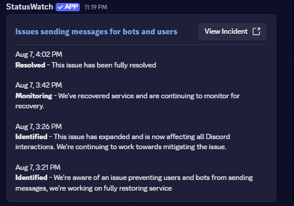
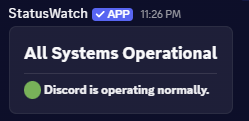

# 🚨 StatusWatch

**Real-time incident monitoring for Discord.**

StatusWatch monitors supported service incidents and delivers notifications directly to Discord, keeping your community informed when something goes wrong.

[](https://discord.com/oauth2/authorize?client_id=1534996220710486229)

---

## ✨ Features

- 🚨 **Incident monitoring** — Receive notifications when supported services report incidents.
- 🔔 **Discord notifications** — Deliver incident updates directly to a configured channel.
- ⚙️ **Simple configuration** — Configure StatusWatch directly through Discord slash commands.

---

## 📸 Examples

## 📸 Examples

| 🚨 Incident Detected | ✅ All Clear |
|:---:|:---:|
|  |  |

---

## 🤖 Commands

StatusWatch uses Discord slash commands for configuration and management.

### `/setincidentchannel`

Sets the Discord channel where incident notifications will be posted.

```text
/setincidentchannel
```

Select the desired channel when prompted.

---

## 🚨 Incident Notifications

When a supported service reports an incident, StatusWatch can post the available incident information to your configured channel.

Notifications may include:

* Incident title
* Current status
* Incident updates
* Timeline information
* Current incident state

The information available may vary depending on the incident and the monitored service.

---

## ⚙️ Getting Started

1. Add StatusWatch to your Discord server.
2. Run `/setincidentchannel`.
3. Select the channel where incident notifications should be posted.

StatusWatch is ready to monitor supported incidents.

---

## 🔔 Service Availability

StatusWatch is designed to provide timely incident information, but notifications may occasionally be delayed or unavailable due to Discord, network connectivity, monitored services, or other external dependencies.

StatusWatch should not be considered a replacement for official service-status sources.

---

## 🔐 Privacy

StatusWatch is designed to process only the information necessary to provide its functionality.

For details about data collection, usage, and retention, see the [Privacy Policy](https://tw1st3dr0d3nt.github.io/status-watch/privacy.html).

---

## 📜 Legal

StatusWatch is an independent third-party Discord application and is not owned, operated, sponsored, or endorsed by Discord Inc.

Use of StatusWatch is also subject to applicable Discord policies and terms.

**[Terms of Service](https://tw1st3dr0d3nt.github.io/status-watch/terms.html)** · **[Privacy Policy](https://tw1st3dr0d3nt.github.io/status-watch/privacy.html)**

---

<div align="center">

**🚨 StatusWatch — Real-time incident monitoring for Discord.**

</div>
